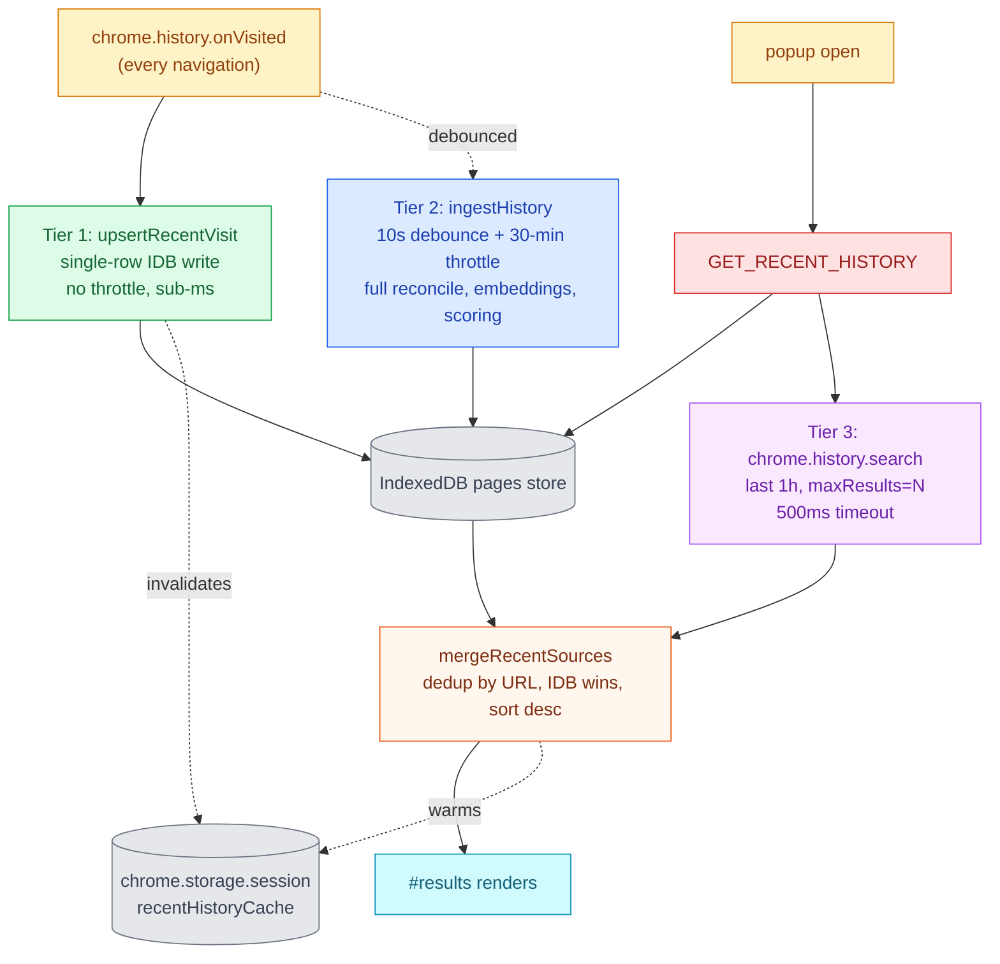

# Indexing & Recent-view Freshness

This skill documents how visits flow from `chrome.history.onVisited`
into the popup's "Recent" list. The goal is simple: **the URL the user
just visited must be at the top of the popup's Recent list the next time
they open it, with no manual action required.**

Three tiers cooperate. Each one is alone insufficient — together they
guarantee freshness in the happy path, robustness under the bulk
indexer's throttle, and a safety net for the rare cases the first two
miss.

## Architecture

## Tier 1 — `upsertRecentVisit` (fast path)

**Where:** [src/background/database.ts](../../../src/background/database.ts) (`upsertRecentVisit`),
[src/background/service-worker.ts](../../../src/background/service-worker.ts) (`onVisited` listener).

**Trigger:** every `chrome.history.onVisited` event.

**Cost:** one IDB read+put + one `chrome.storage.session.remove`. Sub-millisecond.

**Behaviour:**
- New URL → minimal `IndexedItem` with `visitCount: 1`, `lastVisit`, hostname, tokens.
  Bulk indexer enriches embedding/metadata on its next pass.
- Existing URL → preserves embedding, `metaKeywords`, `metaDescription`,
  `isBookmark`, `bookmarkFolders`. Bumps `visitCount`. Advances
  `lastVisit` monotonically (never moves backwards even if a stale
  visit arrives).
- Re-tokenises only when the title changes; otherwise keeps existing tokens.
- Malformed URL → silently no-op. The listener path must never crash.
- Tokeniser is injected so `database.ts` carries no static dependency
  on the search subtree (avoids a circular import).

**Why it exists:** Tier 2's `ingestHistory()` skips incremental work for
30 minutes after its previous run. Without Tier 1, a brand-new visit
could take half an hour to enter IDB and therefore the Recent list.

## Tier 2 — `ingestHistory` (bulk reconciliation)

**Where:** [src/background/indexing.ts](../../../src/background/indexing.ts) (`ingestHistory`,
`performIncrementalHistoryIndexManual`).

**Trigger:**
- Service-worker init (cold start).
- 10 s after the last `onVisited` (debounced via `indexingTimeout` in `service-worker.ts`).
- `MANUAL_INDEX` message (Index Now button — see [src/background/handlers/search-handlers.ts](../../../src/background/handlers/search-handlers.ts)).
- 30-minute throttle inside `ingestHistory` itself: skips work if the
  previous successful run was less than 30 minutes ago.

**Cost:** chrome.history scan + per-item scoring + (optional) embedding
generation. Hundreds of milliseconds to several seconds.

**Why the throttle:** the bulk pipeline does heavy work that's wasteful
to run on every navigation. The throttle keeps re-scoring/re-embedding
batches at a sensible cadence. Tier 1 covers freshness in the meantime.

`MANUAL_INDEX` bypasses the throttle (operator explicitly asked) and
also clears the warm session cache (see Tier 3) so the next popup paint
reads fresh IDB instead of the pre-index snapshot.

## Tier 3 — `mergeRecentSources` (live-merge fallback)

**Where:** [src/background/handlers/recent-merge.ts](../../../src/background/handlers/recent-merge.ts) (pure helper),
[src/background/handlers/search-handlers.ts](../../../src/background/handlers/search-handlers.ts) (`GET_RECENT_HISTORY`).

**Trigger:** every `GET_RECENT_HISTORY` round-trip, behind the
`recentLiveMergeEnabled` setting (default `true` — see [src/core/settings.ts](../../../src/core/settings.ts)).

**Cost:** one `chrome.history.search` call (last 1 hour, capped at the
requested limit) + a pure merge. 500 ms internal `Promise.race` timeout
guards against API stalls.

**Behaviour:**
- IDB row wins on URL conflict (preserves rich fields).
- `lastVisit = max(idb.lastVisit, live.lastVisit)` — fresher live
  timestamp still moves the row up in the sort.
- Live-only URLs synthesised as minimal `IndexedItem`-shaped objects
  tagged `_source: 'live'` for diagnostics.
- Sort by `lastVisit` desc, ties broken by URL.
- Any failure (timeout, missing API, throw, `chrome.runtime.lastError`)
  falls back silently to the IDB-only result. A degraded fallback must
  never become a user-visible error.

**Why it exists:** the rare cases Tier 1 can't catch — extension paused,
transient IDB error, service-worker restart racing `onVisited`. Tier 3
guarantees the popup's Recent list cannot fall behind `chrome.history`
for any URL the user visited in the last hour.

## Warm session cache (`chrome.storage.session.recentHistoryCache`)

Orthogonal to the three tiers: a versioned snapshot (`CACHE_VERSION = 1`)
written by `GET_RECENT_HISTORY` after a successful read so the next
popup open can paint instantly without waiting for the SW round-trip.

**Invalidated by:** `MANUAL_INDEX`, `REBUILD_INDEX`, `CLEAR_ALL_DATA`,
and Tier 1 (`onVisited` fast-path). Each of these changes IDB rows in a
way the cache snapshot cannot anticipate, so dropping the cache forces
the next paint to come from IDB.

See [src/shared/recent-history-cache.ts](../../../src/shared/recent-history-cache.ts).

## Acceptance criteria (the contract this skill defends)

- Open the popup right after visiting a new URL: that URL appears in
  the top results without clicking Index Now.
- Click Index Now while the popup is open: top row reflects the freshest
  IDB state within ~1 second.
- Disable `recentLiveMergeEnabled`: Tiers 1 + 2 still keep Recent fresh
  for navigations the fast-path saw; only the safety net for the rare
  miss is removed.
- Stale warm cache + fresher IDB rows: the popup's final paint shows
  the IDB rows. The cache is best-effort, never authoritative.

## Tests

Unit:
- [src/background/__tests__/database.test.ts](../../../src/background/__tests__/database.test.ts) — `upsertRecentVisit` (Tier 1).
- [src/background/handlers/__tests__/recent-merge.test.ts](../../../src/background/handlers/__tests__/recent-merge.test.ts) — pure merge helper (Tier 3).
- [src/background/handlers/__tests__/search-handlers.test.ts](../../../src/background/handlers/__tests__/search-handlers.test.ts) — `GET_RECENT_HISTORY` integration (Tier 3 enabled / disabled / timeout / sync-throw fallback) and `MANUAL_INDEX` cache invalidation.
- [src/popup/__tests__/popup-utils.test.ts](../../../src/popup/__tests__/popup-utils.test.ts) — `shouldRefreshRecentAfterManualIndex` policy (Tier 2 → UI refresh contract).

E2E:
- [e2e/recent-freshness.spec.ts](../../../e2e/recent-freshness.spec.ts) — three Playwright specs pinning the Tier 1 auto-path, the Tier 2 + UI-refresh contract via `MANUAL_INDEX`, and the warm-cache vs IDB precedence.
- [e2e/warm-cache.spec.ts](../../../e2e/warm-cache.spec.ts) — covers the cache layer's first-paint and invalidation contracts.

## Common pitfalls

- **Adding a new destructive handler that writes to IDB?** Make it
  `clearRecentHistoryCache()` after the write, mirroring `MANUAL_INDEX`
  / `REBUILD_INDEX` / `CLEAR_ALL_DATA`. Skipping this re-introduces the
  v9.2.x stale-Recent bug.
- **Tempted to lower the 30-min `ingestHistory` throttle?** Don't. Tier 1
  already keeps Recent fresh for navigations; the throttle exists to
  rate-limit the heavy bulk re-scoring/re-embedding work. Lowering it
  burns CPU and battery for no Recent-view benefit.
- **Adding fields to `IndexedItem`?** Make sure `upsertRecentVisit`'s
  "preserve existing rich fields" branch carries them across when an
  existing URL is re-visited. The merge in `mergeRecentSources` is a
  spread on the existing IDB row, so it's automatic there.
